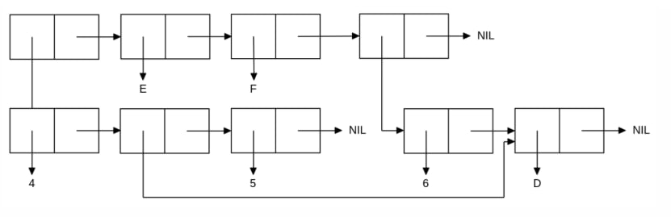

<p align="center"><b>МОНУ НТУУ КПІ ім. Ігоря Сікорського ФПМ СПіСКС</b></p>
<p align="center">
<b>Звіт з лабораторної роботи 1</b><br/>
"Обробка списків з використанням базових функцій"<br/>
дисципліни "Вступ до функціонального програмування"
</p>
<p align="right"><b>Студент(-ка)</b>: Міндер Вадим Юрійович КВ-22</p>
<p align="right"><b>Рік</b>: 2026</p>

## Загальне завдання
<!--
лістинг пунктів загального завдання можна навести або в одному блоці коду
із коментарями, що позначають початок виконання окремих пунктів, або ж
розділити весь лістинг на окремі блоки коду і додати для них підзаголовки
(напр. ### Пункт 1).
-->

```lisp
;; Пункт 1
CL-USER> (setq my-list (list 'a 42 (cons 'b '(c)) nil (list 1 2)))
(A 42 (B C) NIL (1 2))

;; Пункт 2
CL-USER> (car my-list)
A

;; Пункт 3
CL-USER> (cdr my-list)
(42 (B C) NIL (1 2))

;; Пункт 4
CL-USER> (third my-list)
(B C)

;; Пункт 5
CL-USER> (car (last my-list))
(1 2)

;; Пункт 6
CL-USER> (atom (nth 1 my-list))
T
CL-USER> (atom (nth 4 my-list))
NIL
CL-USER> (atom (nth 2 my-list))
NIL
CL-USER> (listp (nth 1 my-list))
NIL
CL-USER> (listp (nth 4 my-list))
T
CL-USER> (listp (nth 2 my-list))
T

;; Пункт 7
CL-USER> (eql (nth 0 my-list) 'A)
T
CL-USER> (numberp (nth 1 my-list))
T
CL-USER> (equal (nth 2 my-list) (list 'B 'C))
T

;; Пункт 8
CL-USER> (append my-list (nth 2 my-list))
(A 42 (B C) NIL (1 2) B C)
```
## Варіант <16>
<p align="center">

</p>

```lisp
CL-USER> (setq var-list (list (list 4 5) 'e 'f (list 6 'd))) 
((4 5) E F (6 D))
```